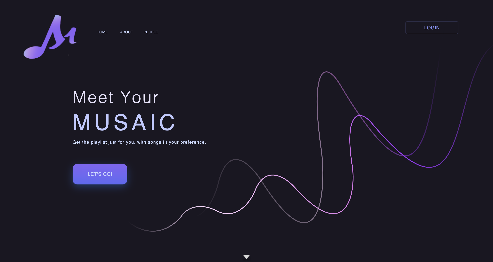
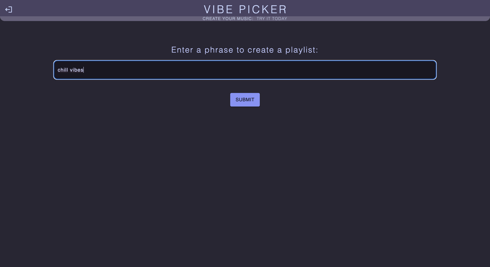

# musaic
This platform has been created with seven other people as a team and this repository has been cloned from a separate collaborative repository. See original repository here: https://github.com/lyraphix/react-top-tracks

Welcome to Musaic, a Spotify-based website that helps you and your friends create collaborative playlists based on your favorite artists and desired vibes. This will walk you through the process of accessing and using the 
Musaic platform.

# Installation and Access
Musaic is a web-based platform, so there is no need to install any software. Simply navigate to the Musaic website using your preferred web browser on your computer, tablet, or smartphone.

NOTE: As the platform utilizes the free access version of the Spotify API, use is limited to 25 registered users on the Spotify API. To request access, please contact the owner of the repository.

# Logging In
To access Musaic, you will need to log in using your existing Spotify account information. Click the "Let’s Go!" or “Login” button on the homepage, and you will be redirected to the Spotify authentication page. 
Enter your Spotify username and password, then grant Musaic permission to access your account information. Once you have completed the authentication process, you will be taken to your Musaic dashboard.

# Dashboard
The dashboard is your central hub for navigating the Musaic platform. From here, you can perform the following actions:

Create A Musaic Lobby:
To create a new collaborative playlist, you can click the "Create a Musaic" button to create a new lobby. From here, you can click the “Copy Musaic Key'' button to copy  your lobby key. Share this key with your friends 
to have them join your Musaic!

Join A Musaic Lobby:
If you’d like to join an existing Musaic lobby, ask a friend to share their Musaic key with you. From the dashboard, click on the “Join A Musaic” button and input the key that was shared with you. 

View Previously Created Playlists:
All of your previously created playlists will be displayed on your dashboard. You can see its tracks by clicking on each playlist, and open it in your Spotify through the “Open In Spotify” button.

Delete Previously Created Playlists:
To delete a previously created playlist, you can click on the red “Delete Playlists” button. This will cause two other buttons to appear beneath it, “Cancel”, and “Delete”, as well as checkboxes beside each playlist. If 
you click “Cancel”, the two buttons, as well as the checkboxes will disappear. However, if you select “Delete”, it will delete the playlists selected with the checkboxes. If no checkboxes are selected, no playlists will be
deleted. The playlists are deleted from both the website and your Spotify library.

Delete User Data: 
To delete the data stored on the site, including information about your Spotify account, such as access token, username, profile picture, created collaborative playlists, created tracks, or top listened artists, you can
click on the top right icon. This icon will either be your Spotify profile picture, if you have one, or the Musaic icon. After clicking this icon, two new buttons will appear, “Log Out” and “Delete User Data”. Select the 
“Delete User Data” button, and this will clear all of the data as well as log the user out. The user will be redirected to the landing page.

Log Out:
To log out of the website, you can click on the top right icon. This will cause two new buttons to appear, “Log Out” and “Delete User Data”. Select “Log Out”. The user will be redirected to the landing page. This action 
will clear their access token, so they must log back in using either the “Let’s Go!” or “Login” buttons on the landing page. 

IMPORTANT: As this was a project that had to be in working condition within a short span of time, some features may not be available.

# Creating a Playlist

Solo or Collaborative:
Musaic allows users to choose between creating a playlist on their own or with their friends. Please refer to the Dashboard section for more information. 

Note: the collaborative feature of Musaic is currently unavailable

Ready Up:
When all invited friends have joined the lobby, each user must click the "Ready" button to indicate they are prepared to proceed.

Vibe Picker:
After everyone is ready, the group will be taken to the "Vibe Picker" page. The host will then input a phrase that represents the vibe they want for the playlist. For example, if you want a playlist with an upbeat, party 
atmosphere, you could enter "dance party!"

Generate Playlist:
Musaic will then use artificial intelligence to analyze the submitted phrase and each user's top Spotify artists. Based on this information, a unique collaborative playlist will be generated that captures the desired vibe
and incorporates the musical tastes of all participants.

User Influence:
The User Influence slider determines how much the user wants their music tastes to be incorporated into their playlist. The lower the value of the User Influence, the more songs there will be that is recommended by the AI,
and the higher the value, the more songs there will be that incorporates the user’s tastes.

Number of Tracks:
You can change the number of songs included in the playlist by adjusting the slider labeled “# of tracks” 

Review and Save:
Review the generated playlist and, if you're satisfied with the result, click the "Create Playlist" button to add it to your Spotify library.

